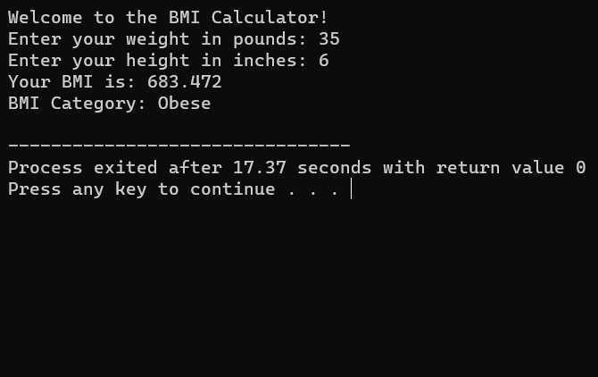

# BMI Calculator C++



## Introduction

Welcome to the BMI Calculator C++ project! This program is a powerful tool to calculate Body Mass Index (BMI) and categorize it into predefined ranges, providing essential health insights.

## BMI Categories

- **Underweight**: BMI < 18.5
- **Normal**: 18.5 ≤ BMI ≤ 24.9
- **Overweight**: 25 ≤ BMI ≤ 29.9
- **Obese**: BMI > 29.9

## Features

- Calculate BMI based on user-provided height and weight.
- Automatically categorize BMI into predefined health categories.
- User-friendly and intuitive interface.

## Usage

1. **Clone the Repository**:

    ```shell
    git clone https://github.com/iMamoonAkhter/BMI-Calculator-C-.git
    ```

2. **Compile the Program**:

    ```shell
    g++ bmi_calculator.cpp -o bmi_calculator
    ```

3. **Run the Program**:

    ```shell
    ./bmi_calculator
    ```

4. Follow the prompts to enter your weight in pounds and your height in inches, and the program will calculate your BMI and display the category.

## Example

```shell
Enter your weight in pounds: 154
Enter your height in inches: 68

BMI: 23.39
Category: Normal
